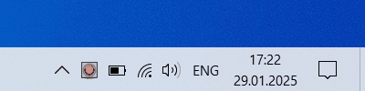

# SystemTrayAnimator

SystemTrayAnimator generates an animation using image files from a specified directory in the System Tray area. Simply copy your images into this directory, and SystemTrayAnimator will play them at a set speed. It not only looks great, but is also handy for keeping you informed about the progress or completion of lengthy tasks, such as transferring large files. You can designate a network drive or folder as the directory, allowing remote addition of images over the network.

## Demo

Green Signal 10 FPS:  

Red Signal 10 FPS:  

Timer 1 FPS:  

Clock 1 FPS:  

Umbrella 10 FPS:  

## Install

* Download the [SystemTrayAnimator](https://github.com/AlexanderPro/SystemTrayAnimator/releases) in the zip file

## Requirements

* OS Windows XP SP3 and later. Supports x86 and x64 systems.
* .NET Framework 4.0

## Files

* SystemTrayAnimator.exe
* SystemTrayAnimator.xml (It is placed in roaming user directory. If you are planing to use SystemTrayAnimator as a portable app, then copy the file to the directory with SystemTrayAnimator.exe)